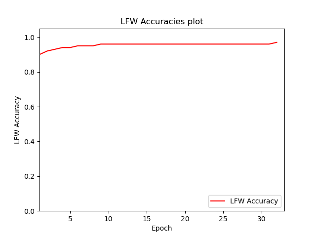

# facenet-pytorch-vggface2 (Under Development, use at your own risk)

__Operating System__: Ubuntu 18.04 (you may face issues importing the packages from the requirements.yml file if your OS differs).

A PyTorch implementation  of the [FaceNet](https://arxiv.org/abs/1503.03832) [1] paper for training a facial recognition model using Triplet Loss and Cross
Entropy Loss with [Center Loss](https://ydwen.github.io/papers/WenECCV16.pdf) [2]. Training is done on the [VGGFace2](http://www.robots.ox.ac.uk/~vgg/data/vgg_face2/) [3] dataset containing 3.3 million face images based on over 9000 human identities.
Evaluation is done on the Labeled Faces in the Wild [4] dataset. Please note there are overlapping identities between the two datasets since both are based on human celebrities (500 identities), __overlapping identities were not removed from the training dataset in this implementation__. A pre-trained model on tripet loss with an accuracy of __96.72%__ on the LFW dataset is provided. Center loss experiments have been not as successful as of yet.

Please let me know if you find mistakes and errors, or improvement ideas for the code and for future training experiments. Feedback would be greatly appreciated as this is still work in progress.


## Pre-trained model

Link to download the pre-trained model using Triplet Loss [here](https://drive.google.com/file/d/1dsE9RlxXzinpHExRXX70TtZPWBVCSO3b/view?usp=sharing).


### Pre-trained Model LFW Test Metrics

__Note__: The model did not improve in following training epochs even with lowering the learning rate, the model was trained by using the hard negatives triplet selection method (__anchor_negative_distance - anchor_positive_distance < margin__). Using semi-hard negatives triplet selection method might lead to better performance. Also, the model was trained on a random triplet batch on every iteration, setting the triplet batch to a set number of human identities might also lead to better performance. Future experiments will be conducted to compare results.




| Architecture | Loss | Triplet loss selection method | Embedding dimension | Margin | Training Epochs | Number of triplets per epoch| Batch Size | Optimizer | Learning Rate | LFW Accuracy| LFW Precision| LFW Recall | ROC Area Under Curve | TAR (True Acceptance Rate) @ FAR (False Acceptance Rate) = 1e-1 | TAR (True Acceptance Rate) @ FAR (False Acceptance Rate) = 1e-2 | TAR (True Acceptance Rate) @ FAR (False Acceptance Rate) = 1e-3 | Best mean Euclidean Distance |
| --- | --- | --- | --- | --- | --- | --- | --- | --- | --- | --- | --- | --- | --- | --- | --- | --- | --- |
| ResNet-18 | Triplet Loss | Hard Negatives | 256 | 0.2 | 32 | 1,100,000 | 256 | SGD (with momentum=0.9) | 0.1 | 0.9672+-0.0067 | 0.9658+-0.0058 | 0.9687+-0.0109 | 0.9936 | 0.9920+-0.0070 | 0.8493+-0.0227 | 0.4377+-0.0190 | 0.9412+-0.004 |


## How to import and use the model
1. Download the model weights file from the [link](https://drive.google.com/file/d/1dsE9RlxXzinpHExRXX70TtZPWBVCSO3b/view?usp=sharing) above into your project.
2. Import the 'resnet.py' and 'utils_resnet.py' modules from the 'models' folder.
3. Create a new folder in your project ('model' in this example).
4. Move the 'resnet.py', 'utils_resnet.py', and the 'model_resnet18_triplet.pt' files into the newly created 'model' folder.
5. Instantiate the model like the following example: 

```
import torch
import torchvision.transforms as transforms
import cv2
from model.resnet import Resnet18Triplet

checkpoint = torch.load('model/model_resnet18_triplet.pt')
model = Resnet18Triplet(embedding_dimension=checkpoint['embedding_dimension'])
model.load_state_dict(checkpoint['model_state_dict'])
best_distance_threshold = checkpoint['best_distance_threshold']

flag_gpu_available = torch.cuda.is_available()

if flag_gpu_available:
    device = torch.device("cuda")
else:
    device = torch.device("cpu")

model.to(device)
model.eval()

preprocess = transforms.Compose([
  transforms.ToPILImage(),
  transforms.Resize(size=224),  # Pre-trained model uses 224x224 input images
  transforms.ToTensor(),
  transforms.Normalize(
      mean=[0.5157, 0.4062, 0.3550],  # Normalization settings for the model (calculated mean and std values
      std=[0.2858, 0.2515, 0.2433]     # for the rgb channels of the cropped VGGFace2 face dataset (with additional margins))
  )
])

img = cv2.imread('face.jpg')  # Or from a cv2 video capture stream

# Convert the image from BGR color (which OpenCV uses) to RGB color
img = img[:, :, ::-1]

img = preprocess(img)
img = img.unsqueeze(0)
img = img.to(device)

embedding = model(img)

# Turn embedding Torch Tensor to Numpy array
embedding = embedding.cpu().detach().numpy()

```


## Training Steps
1. Download the VGGFace2 [dataset](http://www.robots.ox.ac.uk/~vgg/data/vgg_face2/).
2. Download the Labeled Faces in the Wild [dataset](http://vis-www.cs.umass.edu/lfw/#download).  
3. For face alignment for both VGGFace2 and LFW datasets I used David Sandberg's face alignment script via MTCNN (Multi-task Cascaded Convolutional Neural Networks) from his 'facenet' [repository](https://github.com/davidsandberg/facenet):
 Steps to follow [here](https://github.com/davidsandberg/facenet/wiki/Classifier-training-of-inception-resnet-v1#face-alignment) and [here](https://github.com/davidsandberg/facenet/wiki/Validate-on-LFW#4-align-the-lfw-dataset).
 I used --image_size 224 --margin 0 for the VGGFace2 and LFW datasets, running 6 python processes on the VGGFace2 dataset took around 13 hours on an i9 9900KF CPU overclocked to 5 Ghz. I then put both train and test folders into one folder and removed the extra files 
 resulting from the script (bounding box text files).
 
 __Note__: For the current available pre-trained model, I had margin 44 for the VGGFace2 dataset and margin 32 for the LFW dataset, which is why the normalization settings for the pre-trained model is different from the current normalization settings. 


### For Triplet Loss training (Recommended)
__WARNING__: There are triplet iterations that would use more memory than my GPU (TITAN RTX) has. Therefore, the current implementation switches the iteration that causes an Out of Memory Exception from GPU memory to CPU and then switches back to GPU for the following iterations. If you have __less system RAM than available GPU Video RAM__, you __must reduce your batch size__ to avoid crashing your computer. I have also reduced the num_workers value to 1 since workers take a relatively significant amount of system RAM.

 __However, I have noticed the model performance either worsens or stays the same if CPU iterations occur. I have still not found the reason why this happens so I would not recommend relying on the Out of Memory CPU iterations as of yet.__ 

&nbsp;

1. (This step is not needed if the __VGGFace2 dataset__ would be used, the csv file is already available in the 'datasets' directory) Generate a csv file containing the image paths of the dataset by navigating to the datasets folder and running generate_csv_files.py:

    ```
    usage: generate_csv_files.py [-h] --dataroot DATAROOT [--csv_name CSV_NAME]
    
    Generating csv file for triplet loss!
    
    optional arguments:
      -h, --help            show this help message and exit
      --dataroot DATAROOT, -d DATAROOT
                            (REQUIRED) Absolute path to the dataset folder to
                            generate a csv file containing the paths of the images
                            for triplet loss.
      --csv_name CSV_NAME   Required name of the csv file to be generated.
                            (default: 'vggface2.csv')
    ```

2. Type in ```python train_triplet.py -h``` to see the list of training options.
__Note__: '--dataroot' and '--lfw' arguments are required.

    __Note__: Random triplets will be generated in this implementation and the training triplets list will be saved in the 'datasets/' directory as a numpy file that can be used to start training without having to do the triplet generation step from scratch if required (see the __--training_triplets_path argument__). The number of required Python processes to be spawned to generate triplets in parallel to speed up the process can also be specified using the (__--num_generate_triplets_processes__) argument, the __default value of 0__ would generate an amount of processes equal to the amount of __available CPU cores__.

3. To train run ```python train_triplet.py --dataroot "absolute path to dataset folder" --lfw "absolute path to LFW dataset folder"```

4. To resume training run ```python train_triplet.py --resume "path to model checkpoint: (model.pt file)" --dataroot "absolute path to dataset folder" --lfw "absolute path to LFW dataset folder"```

5. (Optional) To __resume training__ but with __skipping the triplet generation process__ if it was done already; run:
```python train_triplet.py --training_triplets_path "datasets/training_triplets_100000.npy" --resume "path to model checkpoint: (model.pt file)" --dataroot "absolute path to dataset folder" --lfw "absolute path to LFW dataset folder"```

```
usage: train_triplet.py [-h] --dataroot DATAROOT --lfw LFW
                        [--dataset_csv DATASET_CSV]
                        [--lfw_batch_size LFW_BATCH_SIZE]
                        [--lfw_validation_epoch_interval LFW_VALIDATION_EPOCH_INTERVAL]
                        [--model_architecture {resnet18,resnet34,resnet50,resnet101,resnet152,inceptionresnetv2,mobilenetv2}]
                        [--epochs EPOCHS]
                        [--training_triplets_path TRAINING_TRIPLETS_PATH]
                        [--num_triplets_train NUM_TRIPLETS_TRAIN]
                        [--num_generate_triplets_processes NUM_GENERATE_TRIPLETS_PROCESSES]
                        [--resume_path RESUME_PATH] [--batch_size BATCH_SIZE]
                        [--num_workers NUM_WORKERS]
                        [--embedding_dim EMBEDDING_DIM]
                        [--pretrained PRETRAINED]
                        [--optimizer {sgd,adagrad,rmsprop,adam}] [--lr LR]
                        [--margin MARGIN] [--image_size IMAGE_SIZE]
                        [--use_semihard_negatives USE_SEMIHARD_NEGATIVES]

Training a FaceNet facial recognition model using Triplet Loss.

optional arguments:
  -h, --help            show this help message and exit
  --dataroot DATAROOT, -d DATAROOT
                        (REQUIRED) Absolute path to the dataset folder
  --lfw LFW             (REQUIRED) Absolute path to the labeled faces in the
                        wild dataset folder
  --dataset_csv DATASET_CSV
                        Path to the csv file containing the image paths of the
                        training dataset.
  --lfw_batch_size LFW_BATCH_SIZE
                        Batch size for LFW dataset (default: 256)
  --lfw_validation_epoch_interval LFW_VALIDATION_EPOCH_INTERVAL
                        Perform LFW validation every n epoch interval
                        (default: every 1 epoch)
  --model_architecture {resnet18,resnet34,resnet50,resnet101,resnet152,inceptionresnetv2,mobilenetv2}
                        The required model architecture for training:
                        ('resnet18','resnet34', 'resnet50', 'resnet101',
                        'resnet152', 'inceptionresnetv2', 'mobilenetv2'),
                        (default: 'resnet18')
  --epochs EPOCHS       Required training epochs (default: 50)
  --training_triplets_path TRAINING_TRIPLETS_PATH
                        Path to training triplets numpy file in 'datasets/'
                        folder to skip training triplet generation step.
  --num_triplets_train NUM_TRIPLETS_TRAIN
                        Number of triplets for training (default: 10000000)
  --num_generate_triplets_processes NUM_GENERATE_TRIPLETS_PROCESSES
                        Number of Python processes to be spawned to generate
                        training triplets. (Default: 0 (number of all
                        available CPU cores)).
  --resume_path RESUME_PATH
                        path to latest model checkpoint:
                        (model_training_checkpoints/model_resnet18_epoch_1.pt
                        file) (default: None)
  --batch_size BATCH_SIZE
                        Batch size (default: 256)
  --num_workers NUM_WORKERS
                        Number of workers for data loaders (default: 1)
  --embedding_dim EMBEDDING_DIM
                        Dimension of the embedding vector (default: 256)
  --pretrained PRETRAINED
                        Download a model pretrained on the ImageNet dataset
                        (Default: False)
  --optimizer {sgd,adagrad,rmsprop,adam}
                        Required optimizer for training the model:
                        ('sgd','adagrad','rmsprop','adam'), (default:
                        'adagrad')
  --lr LR               Learning rate for the optimizer (default: 0.05)
  --margin MARGIN       margin for triplet loss (default: 0.2)
  --image_size IMAGE_SIZE
                        Input image size (default: 224 (224x224), must be
                        299x299 for Inception-ResNet-V2)
  --use_semihard_negatives USE_SEMIHARD_NEGATIVES
                        If True: use semihard negative triplet selection.
                        Else: use hard negative triplet selection (Default:
                        True)
```

### For Center Loss with Cross Entropy training (Not Recommended to use this implementation as of yet)
__Note__: Experiments using this method have not yielded good results, experiments are still on-going so I would not recommend using this training method.


1.  Type in ```python train_center.py -h``` to see the list of options of training.
&nbsp;

    __Note:__ '--dataroot' and '--lfw' arguments are required!

2. To train run ```python train_center.py --dataroot "absolute path to dataset folder" --lfw "absolute path to LFW dataset folder"```
3. To resume training run ```python train_center.py --resume "path to model checkpoint: (model.pt file)" --dataroot "absolute path to dataset folder" --lfw "absolute path to LFW dataset folder"```

```
usage: train_center.py [-h] --dataroot DATAROOT --lfw LFW
                       [--lfw_batch_size LFW_BATCH_SIZE]
                       [--lfw_validation_epoch_interval LFW_VALIDATION_EPOCH_INTERVAL]
                       [--model_architecture {resnet18,resnet34,resnet50,resnet101,resnet152,inceptionresnetv2,mobilenetv2}]
                       [--epochs EPOCHS] [--resume_path RESUME_PATH]
                       [--batch_size BATCH_SIZE] [--num_workers NUM_WORKERS]
                       [--embedding_dim EMBEDDING_DIM]
                       [--pretrained PRETRAINED]
                       [--optimizer {sgd,adagrad,rmsprop,adam}] [--lr LR]
                       [--center_loss_lr CENTER_LOSS_LR]
                       [--center_loss_weight CENTER_LOSS_WEIGHT]
                       [--image_size IMAGE_SIZE]

Training a facial recognition model using Cross Entropy Loss with Center Loss.

optional arguments:
  -h, --help            show this help message and exit
  --dataroot DATAROOT, -d DATAROOT
                        (REQUIRED) Absolute path to the dataset folder
  --lfw LFW             (REQUIRED) Absolute path to the labeled faces in the
                        wild dataset folder
  --lfw_batch_size LFW_BATCH_SIZE
                        Batch size for LFW dataset (default: 128)
  --lfw_validation_epoch_interval LFW_VALIDATION_EPOCH_INTERVAL
                        Perform LFW validation every n epoch interval
                        (default: every 1 epoch)
  --model_architecture {resnet18,resnet34,resnet50,resnet101,resnet152,inceptionresnetv2,mobilenetv2}
                        The required model architecture for training:
                        ('resnet18','resnet34', 'resnet50', 'resnet101',
                        'resnet152', 'inceptionresnetv2', 'mobilenetv2'),
                        (default: 'resnet18')
  --epochs EPOCHS       Required training epochs (default: 50)
  --resume_path RESUME_PATH
                        path to latest model checkpoint:
                        (model_training_checkpoints/model_resnet18_epoch_1.pt
                        file) (default: None)
  --batch_size BATCH_SIZE
                        Batch size (default: 128)
  --num_workers NUM_WORKERS
                        Number of workers for data loaders (default: 8)
  --embedding_dim EMBEDDING_DIM
                        Dimension of the embedding vector (default: 256)
  --pretrained PRETRAINED
                        Download a model pretrained on the ImageNet dataset
                        (Default: False)
  --optimizer {sgd,adagrad,rmsprop,adam}
                        Required optimizer for training the model:
                        ('sgd','adagrad','rmsprop','adam'), (default: 'sgd')
  --lr LR               Learning rate for the optimizer (default: 0.01)
  --center_loss_lr CENTER_LOSS_LR
                        Learning rate for center loss (default: 0.5)
  --center_loss_weight CENTER_LOSS_WEIGHT
                        Center loss weight (default: 0.007)
  --image_size IMAGE_SIZE
                        Input image size (default: 224 (224x224), must be
                        299x299 for Inception-ResNet-V2)
```

## Model state dictionary
### Triplet Loss Model
```
        state = {
            'epoch': epoch + 1,
            'embedding_dimension': embedding_dimension,
            'batch_size_training': batch_size,
            'model_state_dict': model.state_dict(),
            'model_architecture': model_architecture,
            'optimizer_model_state_dict': optimizer_model.state_dict(),
            'best_distance_threshold': best_distance_threshold
        }
```

### Center Loss Model
```
        state = {
            'epoch': epoch + 1,
            'num_classes': num_classes,
            'embedding_dimension': embedding_dimension,
            'batch_size_training': batch_size,
            'model_state_dict': model.state_dict(),
            'model_architecture': model_architecture,
            'optimizer_model_state_dict': optimizer_model.state_dict(),
            'optimizer_centerloss_state_dict': optimizer_centerloss.state_dict(),
            'best_distance_threshold': best_distance_threshold
        }
```

## Inspirations (repositories)
* https://github.com/davidsandberg/facenet
* https://github.com/liorshk/facenet_pytorch
* https://github.com/KaiyangZhou/pytorch-center-loss (imported 'center_loss.py' from this repository).
* https://github.com/tbmoon/facenet ('triplet_loss.py' and 'triplet_loss_dataloader.py' were imported from this repository)

## References
* [1] Florian Schroff, Dmitry Kalenichenko, James Philbin, “FaceNet: A Unified Embedding for Face Recognition and Clustering”:
 [paper](https://arxiv.org/abs/1503.03832)

* [2] Yandong Wen, Kaipeng Zhang, Zhifeng Li, Yu Qiao, "A Discriminative Feature Learning Approachfor Deep Face Recognition": [paper](https://ydwen.github.io/papers/WenECCV16.pdf)

* [3] Q. Cao, L. Shen, W. Xie, O. M. Parkhi, A. Zisserman
"VGGFace2: A dataset for recognising faces across pose and age":
[paper](https://arxiv.org/abs/1710.08092), [dataset](http://www.robots.ox.ac.uk/~vgg/data/vgg_face2/)

* [4] Gary B. Huang, Manu Ramesh, Tamara Berg, and Erik Learned-Miller.
"Labeled Faces in the Wild: A Database for Studying Face Recognition in Unconstrained Environments": [paper](http://vis-www.cs.umass.edu/lfw/lfw.pdf)
