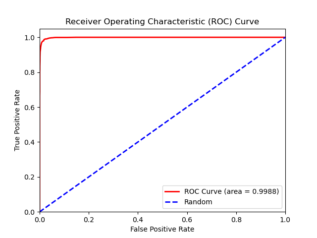

# facenet-pytorch-glint360k


__Operating System__: Ubuntu 18.04 (you may face issues importing the packages from the requirements.yml file if your OS differs).

A PyTorch implementation  of the [FaceNet](https://arxiv.org/abs/1503.03832) [[1](#references)] paper for training a facial recognition model using Triplet Loss. Training is done on the [glint360k](https://github.com/deepinsight/insightface/wiki/Dataset-Zoo#glint360k-360k-ids17m-images17-recommend) [[4](#references)] dataset containing around 17 million face images distributed on 360k human identities.
Evaluation is done on the [Labeled Faces in the Wild](http://vis-www.cs.umass.edu/lfw/) [[3](#references)] dataset. Please note that no overlapping idenities were removed as far as I am aware there is no metadata file for glint360k unless I am mistaken. Previous experiments were conducted using the [VGGFace2](https://www.robots.ox.ac.uk/~vgg/data/vgg_face2/) [[2](#references)] dataset as well.

The datasets face images were tightly-cropped by using the MTCNN Face Detection model in David Sandberg's [facenet](https://github.com/davidsandberg/facenet) repository. For more information, and download links for the __cropped__ datasets, please check the [Training and Testing Datasets section](#training-and-testing-datasets).

A pre-trained model on tripet loss with an accuracy of __98.45%__ on the LFW dataset is provided in the pre-trained model section. Although I would only use it for __very small-scale facial recognition__.

Please let me know if you find mistakes and errors, or improvement ideas for the code and for future training experiments. Feedback would be greatly appreciated as this is work in progress.

### Inspirations (GitHub repositories)
Please check them out:

* https://github.com/liorshk/facenet_pytorch
* https://github.com/tbmoon/facenet
* https://github.com/davidsandberg/facenet


### Pre-trained model
Link to download the 98.45% lfw accuracy pre-trained model using Triplet Loss [here](https://drive.google.com/file/d/1mx8-YZpGnBw3nAEC_MBtGs8j94AskDBB/view?usp=sharing).
__Only use it for very small-scale facial recognition__.


### Pre-trained Model LFW Test Metrics




| Architecture | Loss | Triplet loss selection method | Image Size | Embedding dimension | Margin | Batch Size | Number of identities per triplet batch | Learning Rate | Training Epochs | Number of training iterations per epoch | Optimizer | LFW Accuracy| LFW Precision| LFW Recall | ROC Area Under Curve | TAR (True Acceptance Rate) @ FAR (False Acceptance Rate) = 1e-3 | Best LFW Euclidean distance threshold
| --- | --- | --- | --- | --- | --- | --- | --- | --- | --- | --- | --- | --- | --- | --- | --- | --- | --- |
| ResNet-34 | Tripet Loss | Hard-negatives | 140x140 | 512 | 0.2 | 544 | 32 | 0.075 then lowered to 0.01 at epoch 85 (checkpoint 84) | 88 | 5000 (440,000 training iterations) | __Adagrad__ (with weight_decay=1e-5, initial_accumulator_value=0.1, eps=1e-10) | 98.45%+-0.5167 | 98.24%+-0.56 | 98.67+-0.94 | 0.9988 | 85.17% | 0.98 |


### Model state dictionary
```
    state = {
        'epoch': epoch,
        'embedding_dimension': embedding_dimension,
        'batch_size_training': batch_size,
        'model_state_dict': model.state_dict(),
        'model_architecture': model_architecture,
        'optimizer_model_state_dict': optimizer_model.state_dict(),
        'best_distance_threshold': best_distance_threshold
    }
```


### How to import and use the pre-trained model
__Note__: The facial recognition model should be used with a face detection model (preferably the [MTCNN Face Detection Model]((#training-and-testing-datasets)) from David Sandberg's [facenet](https://github.com/davidsandberg/facenet) repository that was used to crop the training and test datasets for this model). The face detection model would predict the bounding box coordinates of human face in an input image then the face would be cropped and resized to size 140x140 and then inputted to the facial recognition model. Using images with no tightly-cropped face images by a face detection model as input to the facial recognition model would yield bad results. For a working example please check my other [repository](https://github.com/tamerthamoqa/facenet-realtime-face-recognition). I intend to do a pytorch version of that repository once I manage to train a facial recognition model with satisfactory LFW results.


1. Download the model (.pt) file from the [link](#pre-trained-model) above into your project.
2. Import the 'resnet.py' and 'utils_resnet.py' modules from the 'models' folder.
3. Create a new folder in your project ('model' in this example).
4. Move the 'resnet.py', 'utils_resnet.py', and the 'model_resnet34_triplet.pt' files into the newly created 'model' folder.
5. Instantiate the model like the following example: 

```
import torch
import torchvision.transforms as transforms
import cv2
from model.resnet import Resnet34Triplet

flag_gpu_available = torch.cuda.is_available()
if flag_gpu_available:
    device = torch.device("cuda")
else:
    device = torch.device("cpu")

checkpoint = torch.load('model/model_resnet34_triplet.pt', map_location=device)
model = Resnet34Triplet(embedding_dimension=checkpoint['embedding_dimension'])
model.load_state_dict(checkpoint['model_state_dict'])
best_distance_threshold = checkpoint['best_distance_threshold']

model.to(device)
model.eval()

preprocess = transforms.Compose([
  transforms.ToPILImage(),
  transforms.Resize(size=140),  # Pre-trained model uses 140x140 input images
  transforms.ToTensor(),
  transforms.Normalize(
      mean=[0.6071, 0.4609, 0.3944],  # Normalization settings for the model, the calculated mean and std values
      std=[0.2457, 0.2175, 0.2129]     # for the RGB channels of the tightly-cropped glint360k face dataset
  )
])

img = cv2.imread('face.jpg')  # Or from a cv2 video capture stream

# Note that you need to use a face detection model here to crop the face from the image and then
#  create a new face image object that will be inputted to the facial recognition model later.

# Convert the image from BGR color (which OpenCV uses) to RGB color
img = img[:, :, ::-1]

img = preprocess(img)
img = img.unsqueeze(0)
img = img.to(device)

embedding = model(img)

# Turn embedding Torch Tensor to Numpy array
embedding = embedding.cpu().detach().numpy()
```


### Training and Testing Datasets

* Original datasets download links:
    * glint360k training dataset: [link](https://github.com/deepinsight/insightface/wiki/Dataset-Zoo#glint360k-360k-ids17m-images17-recommend)
    * glint360k dataset (unpacked and available on my Google Drive): [Drive](https://drive.google.com/file/d/1VV5uUIz-_1lEeir8TOosfR6XfecaMGkR/view?usp=sharing)
    * VGGFace2 training dataset: [official website](http://www.robots.ox.ac.uk/~vgg/data/vgg_face2/), [AcademicTorrents](https://academictorrents.com/details/535113b8395832f09121bc53ac85d7bc8ef6fa5b)
    * Labeled Faces in the Wild test dataset: [official website](http://vis-www.cs.umass.edu/lfw/#download)


* Download the __cropped face datasets using the MTCNN Face Detection model__ that are used for training and testing the model:
    * glint360k training dataset (224x224): [Drive](https://drive.google.com/file/d/1szJJEZpE2LIqWpYYsQDBQPt9KOmbhFn9/view?usp=sharing)
    * VGGFace2 training dataset (224x224): [Drive](https://drive.google.com/file/d/1e3m9e2xy8RWG6bC2v3OT7fOcGe8VI7u_/view?usp=sharing)
    * Labeled Faces in the wild testing dataset (224x224): [Drive](https://drive.google.com/file/d/1-_OGokxUWBgwgrig2OUXN4k3izrMO2eB/view?usp=sharing)


* Training datasets __file paths csv files__ (to be put inside the 'datasets' folder):
    * glint360k: [link](https://drive.google.com/file/d/1-Giep-w2129zydCUOjpCCi7lkGstqdRk/view?usp=sharing)
    * VGGFace2: [link](https://drive.google.com/file/d/1eI_2TfpDOUN89Tl_orwaffVMD5DSw1he/view?usp=sharing)


* For cropping the original face datasets using the David Sandberg 'facenet' repository MTCNN Face Detection model:
    * For face cropping for all three datasets; I used David Sandberg's face cropping script via MTCNN (Multi-task Cascaded Convolutional Neural Networks) from his 'facenet' [repository](https://github.com/davidsandberg/facenet):
    Steps to follow [here](https://github.com/davidsandberg/facenet/wiki/Classifier-training-of-inception-resnet-v1#face-alignment) and [here](https://github.com/davidsandberg/facenet/wiki/Validate-on-LFW#4-align-the-lfw-dataset).
    I used __--image_size 224 --margin 0__. and removed the extra files resulting from the script (bounding box text files). Running 6 python processes on an i9-9900KF CPU overclocked to 5Ghz took around 13 hours on the VGGFace2 dataset and some days for the glint360k dataset. Managing to run the workload on CUDA would make the process several times faster but I had issues with CUDA 9 on my system.  


### Model Training
__Notes__: 
* Training triplets will be generated at the beginning of each epoch and will be saved in the 'datasets/generated_triplets' directory as numpy files that can be loaded at the beginning of an epoch to start training without having to do the triplet generation step from scratch if required (see the __--training_triplets_path argument__).
* Each triplet batch will be constrained to a number of human identities (see the __--num_human_identities_per_batch__ argument).

&nbsp;
1. Generate a csv file containing the image paths of the dataset by navigating to the datasets folder and running generate_csv_files.py. Or by downloading the csv files from the [Training and Testing Datasets](#training-and-testing-datasets) section and inserting the files into the 'datasets' folder:
    
    ```
    usage: generate_csv_files.py [-h] --dataroot DATAROOT [--csv_name CSV_NAME]
    
    Generating csv file for triplet loss!
    
    optional arguments:
      -h, --help            show this help message and exit
      --dataroot DATAROOT, -d DATAROOT
                            (REQUIRED) Absolute path to the dataset folder to
                            generate a csv file containing the paths of the images
                            for triplet loss.
      --csv_name CSV_NAME   Required name of the csv file to be generated.
                            (default: 'vggface2.csv')
    ```

2. Type in ```python train_triplet_loss.py -h``` to see the list of training options.
__Note__: '--dataroot' and '--lfw' arguments are required.

3. To train run: 
   ```
   python train_triplet_loss.py --dataroot "absolute path to dataset folder" --lfw "absolute path to LFW dataset folder"
   ```

4. To resume training from a model checkpoint run:
   ```
   python train_triplet_loss.py --resume "path to model checkpoint: (model.pt file)" --dataroot "absolute path to dataset folder" --lfw "absolute path to LFW dataset folder"
   ```

5. (Optional) To __resume training from a model checkpoint__ but with __skipping the triplet generation process for the first epoch__ if the triplets file was already generated; run:
    ```
    python train_triplet_loss.py --training_triplets_path "datasets/generated_triplets/[name_of_file_here].npy" --resume "path to model checkpoint: (model.pt file)" --dataroot "absolute path to dataset folder" --lfw "absolute path to LFW dataset folder"
    ```

    ```
    usage: train_triplet_loss.py [-h] --dataroot DATAROOT --lfw LFW
                                 [--training_dataset_csv_path TRAINING_DATASET_CSV_PATH]
                                 [--epochs EPOCHS]
                                 [--iterations_per_epoch ITERATIONS_PER_EPOCH]
                                 [--model_architecture {resnet18,resnet34,resnet50,resnet101,resnet152,inceptionresnetv2,mobilenetv2}]
                                 [--pretrained PRETRAINED]
                                 [--embedding_dimension EMBEDDING_DIMENSION]
                                 [--num_human_identities_per_batch NUM_HUMAN_IDENTITIES_PER_BATCH]
                                 [--batch_size BATCH_SIZE]
                                 [--lfw_batch_size LFW_BATCH_SIZE]
                                 [--resume_path RESUME_PATH]
                                 [--num_workers NUM_WORKERS]
                                 [--optimizer {sgd,adagrad,rmsprop,adam}]
                                 [--learning_rate LEARNING_RATE] [--margin MARGIN]
                                 [--image_size IMAGE_SIZE]
                                 [--use_semihard_negatives USE_SEMIHARD_NEGATIVES]
                                 [--training_triplets_path TRAINING_TRIPLETS_PATH]
    
    Training a FaceNet facial recognition model using Triplet Loss.
    
    optional arguments:
      -h, --help            show this help message and exit
      --dataroot DATAROOT, -d DATAROOT
                            (REQUIRED) Absolute path to the training dataset
                            folder
      --lfw LFW             (REQUIRED) Absolute path to the labeled faces in the
                            wild dataset folder
      --training_dataset_csv_path TRAINING_DATASET_CSV_PATH
                            Path to the csv file containing the image paths of the
                            training dataset
      --epochs EPOCHS       Required training epochs (default: 150)
      --iterations_per_epoch ITERATIONS_PER_EPOCH
                            Number of training iterations per epoch (default:
                            5000)
      --model_architecture {resnet18,resnet34,resnet50,resnet101,resnet152,inceptionresnetv2,mobilenetv2}
                            The required model architecture for training:
                            ('resnet18','resnet34', 'resnet50', 'resnet101',
                            'resnet152', 'inceptionresnetv2', 'mobilenetv2'),
                            (default: 'resnet34')
      --pretrained PRETRAINED
                            Download a model pretrained on the ImageNet dataset
                            (Default: False)
      --embedding_dimension EMBEDDING_DIMENSION
                            Dimension of the embedding vector (default: 512)
      --num_human_identities_per_batch NUM_HUMAN_IDENTITIES_PER_BATCH
                            Number of set human identities per generated triplets
                            batch. (Default: 32).
      --batch_size BATCH_SIZE
                            Batch size (default: 544)
      --lfw_batch_size LFW_BATCH_SIZE
                            Batch size for LFW dataset (6000 pairs) (default: 200)
      --resume_path RESUME_PATH
                            path to latest model checkpoint:
                            (model_training_checkpoints/model_resnet34_epoch_1.pt
                            file) (default: None)
      --num_workers NUM_WORKERS
                            Number of workers for data loaders (default: 4)
      --optimizer {sgd,adagrad,rmsprop,adam}
                            Required optimizer for training the model:
                            ('sgd','adagrad','rmsprop','adam'), (default:
                            'adagrad')
      --learning_rate LEARNING_RATE
                            Learning rate for the optimizer (default: 0.075)
      --margin MARGIN       margin for triplet loss (default: 0.2)
      --image_size IMAGE_SIZE
                            Input image size (default: 140 (140x140))
      --use_semihard_negatives USE_SEMIHARD_NEGATIVES
                            If True: use semihard negative triplet selection.
                            Else: use hard negative triplet selection (Default:
                            False)
      --training_triplets_path TRAINING_TRIPLETS_PATH
                            Path to training triplets numpy file in
                            'datasets/generated_triplets' folder to skip training
                            triplet generation step for the first epoch.
    ```

### References
* [1] Florian Schroff, Dmitry Kalenichenko, James Philbin, “FaceNet: A Unified Embedding for Face Recognition and Clustering”:
 [arxiv](https://arxiv.org/abs/1503.03832)

* [2] Q. Cao, L. Shen, W. Xie, O. M. Parkhi, A. Zisserman
"VGGFace2: A dataset for recognising faces across pose and age":
[arxiv](https://arxiv.org/abs/1710.08092)

* [3] Gary B. Huang, Manu Ramesh, Tamara Berg, and Erik Learned-Miller.
"Labeled Faces in the Wild: A Database for Studying Face Recognition in Unconstrained Environments": [pdf](http://vis-www.cs.umass.edu/lfw/lfw.pdf)
  
* [4] An, Xiang and Zhu, Xuhan and Xiao, Yang and Wu, Lan and Zhang, Ming and Gao, Yuan and Qin, Bin and Zhang, Debing and Fu Ying. Partial FC: Training 10 Million Identities on a Single Machine, arxiv:2010.05222, 2020: [arxiv](https://arxiv.org/abs/2010.05222)


### Hardware Specifications
* TITAN RTX Graphics Card (24 gigabytes Video RAM).
* i9-9900KF Intel CPU overclocked to 5 GHz.
* 32 Gigabytes DDR4 RAM at 3200 MHz.
