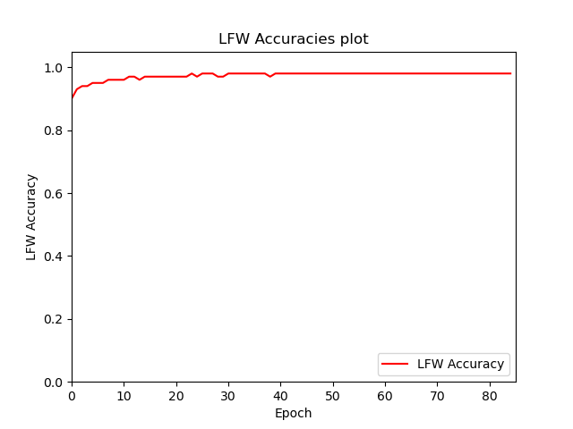
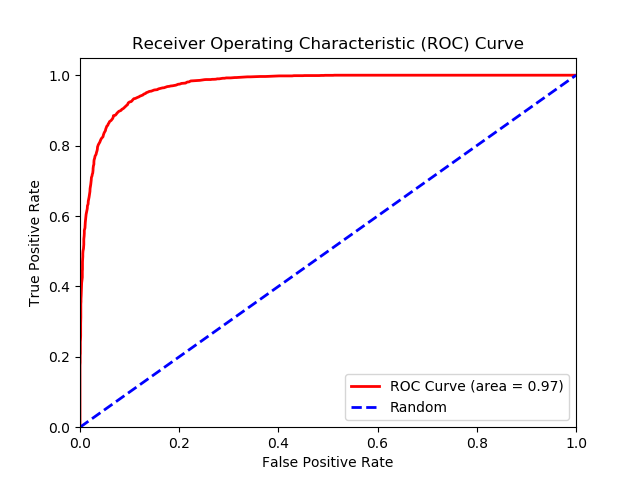

# facenet-pytorch-vggface2

__Operating System__: Ubuntu 18.04 (you may face issues importing the packages from the requirements.yml file if your OS differs).

A PyTorch implementation  of the [FaceNet](https://arxiv.org/abs/1503.03832) [1] paper for training a facial recognition model using Triplet Loss and Cross
Entropy Loss with [Center Loss](https://ydwen.github.io/papers/WenECCV16.pdf) [2]. Training is done on the [VGGFace2](http://www.robots.ox.ac.uk/~vgg/data/vgg_face2/) [3] dataset containing 3.3 million face images based on over 9000 human identities.
Evaluation is done on the Labeled Faces in the Wild [4] dataset. Please note there are overlapping identities between the two datasets since both are based on human celebrities (500 identities), overlapping identities were not removed from the training dataset in this implementation. A pre-trained model on tripet loss with an accuracy of 91% on the LFW dataset is provided. Center loss experiments have been not as successful as of yet.

Please let me know if you find mistakes and errors, or improvement ideas for the code. Feedback would be greatly appreciated as this is still work in progress.


## Pre-trained model
Link to download the pre-trained model using Triplet Loss [here](https://drive.google.com/file/d/10xcG7WrVRr7pCHimG3-3dI1YF6xDYXjA/view).
&nbsp;

__Note:__ the training_triplets.npy file used to train this model is not available.

## How to import and use the model
1. Download the model weights from the link above into your project.
2. Import the 'resnet.py' and the 'utils_resnet.py' modules from the 'models/' folder into your project in the same directory.
3. Import the 'resnet.py' module and instantiate the model like the following example:

```
from resnet import Resnet34Triplet

checkpoint = torch.load('model_resnet34_triplet.pt')
model = Resnet34Triplet(embedding_dimension=checkpoint['embedding_dimension'])
model.load_state_dict(checkpoint['model_state_dict'])
best_distance_threshold = checkpoint['best_distance_threshold']
```

#### Model Performance





| Architecture | Loss | Embedding dimension | Margin | Training Epochs | Number of triplets per epoch| Batch Size | Train Dataloader Shuffle | Optimizer | Learning Rate | LFW Accuracy| LFW Precision| LFW Recall | TAR (True Accept Rate) @ FAR (False Accept Rate) = 1e-1 | TAR (True Accept Rate) @ FAR (False Accept Rate) = 1e-2 | TAR (True Accept Rate) @ FAR (False Accept Rate) = 1e-3 |
| --- | --- | --- | --- | --- | --- | --- | --- | --- | --- | --- | --- | --- | --- | --- | --- |
| ResNet-34 | Triplet Loss | 128 | 0.5 | 27 | 100,000| 64 | False | SGD | 0.1 | 0.9113+-0.0081 | 0.8968+-0.0127 | 0.93+-0.0151 | 0.9243+-0.0171 | 0.5683+-0.0187 | 0.2567+-0.0237 |

This model would be fine for a small-scale facial recognition system. However, for a larger-scale facial recognition system more training and a more complex model would be a better option.


## Training Steps
1. Download the VGGFace2 [dataset](http://www.robots.ox.ac.uk/~vgg/data/vgg_face2/).
2. Download the Labeled Faces in the Wild [dataset](http://vis-www.cs.umass.edu/lfw/#download).  
3. For face alignment for both VGGFace2 and LFW datasets I used David Sandberg's face alignment script via MTCNN (Multi-task Cascaded Convolutional Neural Networks) from his 'facenet' [repository](https://github.com/davidsandberg/facenet):
 Steps to follow [here](https://github.com/davidsandberg/facenet/wiki/Classifier-training-of-inception-resnet-v1#face-alignment) and [here](https://github.com/davidsandberg/facenet/wiki/Validate-on-LFW#4-align-the-lfw-dataset).
 I used --image_size 182 --margin 44 for VGGFace2 and --image_size 160 --margin 32 for LFW, running 3 python processes on the VGGFace2 dataset took around 24 hours. I then put both train and test folders into one folder and removed the extra files 
 resulting from the script (bounding box text files).

### For Triplet Loss training (Recommended)
__Note__: Random triplets will be generated in this implementation and the triplet selection method is based on hard negatives __(anchor_negative_distance - anchor_positive_distance < margin)__, the training triplets list will be saved in the 'datasets/' directory as a numpy file that can be used to start training without having to do the triplet generation step from scratch if required (see the --training_triplets_path argument in the Triplet Loss training section).


1. Generate a csv file containing the image paths of the dataset
by navigating to the datasets folder and running generate_csv_files.py:

```
usage: generate_csv_files.py [-h] --dataroot DATAROOT [--csv_name CSV_NAME]

Generating csv file for triplet loss!

optional arguments:
  -h, --help            show this help message and exit
  --dataroot DATAROOT, -d DATAROOT
                        (REQUIRED) Absolute path to the dataset folder to
                        generate a csv file containing the paths of the images
                        for triplet loss.
  --csv_name CSV_NAME   Required name of the csv file to be generated.
                        (default: 'vggface2.csv')
```

2. Type in ```python train_triplet.py -h``` to see the list of training options.
__Note__: '--dataroot' and '--lfw' arguments are required.

3. To train run ```python train_triplet.py --dataroot "absolute path to dataset folder" --lfw "absolute path to LFW dataset folder"```

4. To resume training run ```python train_triplet.py --resume "path to model checkpoint: (model.pt file)" --dataroot "absolute path to dataset folder" --lfw "absolute path to LFW dataset folder"```

5. (Optional) To __resume training__ but with __skipping the triplet generation process__ if it was done already; run:
```python train_triplet.py --training_triplets_path "datasets/training_triplets_100000.npy" --resume "path to model checkpoint: (model.pt file)" --dataroot "absolute path to dataset folder" --lfw "absolute path to LFW dataset folder"```

```
usage: train_triplet.py [-h] --dataroot DATAROOT --lfw LFW
                        [--dataset_csv DATASET_CSV]
                        [--lfw_batch_size LFW_BATCH_SIZE]
                        [--lfw_validation_epoch_interval LFW_VALIDATION_EPOCH_INTERVAL]
                        [--model {resnet18,resnet34,resnet50,resnet101,resnet152,inceptionresnetv2}]
                        [--epochs EPOCHS]
                        [--training_triplets_path TRAINING_TRIPLETS_PATH]
                        [--num_triplets_train NUM_TRIPLETS_TRAIN]
                        [--resume_path RESUME_PATH] [--batch_size BATCH_SIZE]
                        [--num_workers NUM_WORKERS]
                        [--embedding_dim EMBEDDING_DIM]
                        [--pretrained PRETRAINED]
                        [--optimizer {sgd,adagrad,rmsprop,adam}] [--lr LR]
                        [--margin MARGIN]

Training a FaceNet facial recognition model using Triplet Loss.

optional arguments:
  -h, --help            show this help message and exit
  --dataroot DATAROOT, -d DATAROOT
                        (REQUIRED) Absolute path to the dataset folder
  --lfw LFW             (REQUIRED) Absolute path to the labeled faces in the
                        wild dataset folder
  --dataset_csv DATASET_CSV
                        Path to the csv file containing the image paths of the
                        training dataset.
  --lfw_batch_size LFW_BATCH_SIZE
                        Batch size for LFW dataset (default: 64)
  --lfw_validation_epoch_interval LFW_VALIDATION_EPOCH_INTERVAL
                        Perform LFW validation every n epoch interval
                        (default: every 1 epoch)
  --model {resnet18,resnet34,resnet50,resnet101,resnet152,inceptionresnetv2}
                        The required model architecture for training:
                        ('resnet18','resnet34', 'resnet50', 'resnet101',
                        'resnet152', 'inceptionresnetv2'), (default:
                        'resnet34')
  --epochs EPOCHS       Required training epochs (default: 30)
  --training_triplets_path TRAINING_TRIPLETS_PATH
                        Path to training triplets numpy file in 'datasets/'
                        folder to skip training triplet generation step.
  --num_triplets_train NUM_TRIPLETS_TRAIN
                        Number of triplets for training (default: 1100000)
  --resume_path RESUME_PATH
                        path to latest model checkpoint:
                        (Model_training_checkpoints/model_resnet34_epoch_0.pt
                        file) (default: None)
  --batch_size BATCH_SIZE
                        Batch size (default: 64)
  --num_workers NUM_WORKERS
                        Number of workers for data loaders (default: 8)
  --embedding_dim EMBEDDING_DIM
                        Dimension of the embedding vector (default: 128)
  --pretrained PRETRAINED
                        Download a model pretrained on the ImageNet dataset
                        (Default: False)
  --optimizer {sgd,adagrad,rmsprop,adam}
                        Required optimizer for training the model:
                        ('sgd','adagrad','rmsprop','adam'), (default: 'sgd')
  --lr LR               Learning rate for the optimizer (default: 0.001)
  --margin MARGIN       margin for triplet loss (default: 0.2)
```

### For Center Loss with Cross Entropy training (Not Recommended to use this implementation as of yet)

1.  Type in ```python train_center.py -h``` to see the list of options of training.
&nbsp;

    __Note:__ '--dataroot' and '--lfw' arguments are required!

2. To train run ```python train_center.py --dataroot "absolute path to dataset folder" --lfw "absolute path to LFW dataset folder"```
3. To resume training run ```python train_center.py --resume "path to model checkpoint: (model.pt file)" --dataroot "absolute path to dataset folder" --lfw "absolute path to LFW dataset folder"```

```
usage: train_center.py [-h] --dataroot DATAROOT --lfw LFW
                       [--lfw_batch_size LFW_BATCH_SIZE]
                       [--lfw_validation_epoch_interval LFW_VALIDATION_EPOCH_INTERVAL]
                       [--model {resnet18,resnet34,resnet50,resnet101,resnet152,inceptionresnetv2}]
                       [--epochs EPOCHS] [--resume_path RESUME_PATH]
                       [--batch_size BATCH_SIZE] [--num_workers NUM_WORKERS]
                       [--embedding_dim EMBEDDING_DIM]
                       [--pretrained PRETRAINED]
                       [--optimizer {sgd,adagrad,rmsprop,adam}] [--lr LR]
                       [--center_loss_lr CENTER_LOSS_LR]
                       [--center_loss_weight CENTER_LOSS_WEIGHT]

Training a facial recognition model using Cross Entropy Loss with Center Loss.

optional arguments:
  -h, --help            show this help message and exit
  --dataroot DATAROOT, -d DATAROOT
                        (REQUIRED) Absolute path to the dataset folder
  --lfw LFW             (REQUIRED) Absolute path to the labeled faces in the
                        wild dataset folder
  --lfw_batch_size LFW_BATCH_SIZE
                        Batch size for LFW dataset (default: 64)
  --lfw_validation_epoch_interval LFW_VALIDATION_EPOCH_INTERVAL
                        Perform LFW validation every n epoch interval
                        (default: every 1 epoch)
  --model {resnet18,resnet34,resnet50,resnet101,resnet152,inceptionresnetv2}
                        The required model architecture for training:
                        ('resnet18','resnet34', 'resnet50', 'resnet101',
                        'resnet152', 'inceptionresnetv2'), (default:
                        'resnet34')
  --epochs EPOCHS       Required training epochs (default: 30)
  --resume_path RESUME_PATH
                        path to latest model checkpoint:
                        (Model_training_checkpoints/model_resnet34_epoch_1.pt
                        file) (default: None)
  --batch_size BATCH_SIZE
                        Batch size (default: 64)
  --num_workers NUM_WORKERS
                        Number of workers for data loaders (default: 8)
  --embedding_dim EMBEDDING_DIM
                        Dimension of the embedding vector (default: 128)
  --pretrained PRETRAINED
                        Download a model pretrained on the ImageNet dataset
                        (Default: False)
  --optimizer {sgd,adagrad,rmsprop,adam}
                        Required optimizer for training the model:
                        ('sgd','adagrad','rmsprop','adam'), (default: 'sgd')
  --lr LR               Learning rate for the optimizer (default: 0.001)
  --center_loss_lr CENTER_LOSS_LR
                        Learning rate for center loss (default: 0.5)
  --center_loss_weight CENTER_LOSS_WEIGHT
                        Center loss weight (default: 0.007)
```

## Model state dictionary
### Triplet Loss Model
```
        state = {
            'epoch': epoch+1,
            'embedding_dimension': embedding_dimension,
            'batch_size_training': batch_size,
            'model_state_dict': model.state_dict(),
            'model_architecture': model_architecture,
            'optimizer_model_state_dict': optimizer_model.state_dict(),
            'best_distance_threshold': best_distance_threshold
        }
```

### Center Loss Model
```
        state = {
            'epoch': epoch+1,
            'num_classes': num_classes,
            'embedding_dimension': embedding_dimension,
            'batch_size_training': batch_size,
            'model_state_dict': model.state_dict(),
            'model_architecture': model_architecture,
            'optimizer_model_state_dict': optimizer_model.state_dict(),
            'optimizer_centerloss_state_dict': optimizer_centerloss.state_dict(),
            'best_distance_threshold': best_distance_threshold
        }
```

## Inspirations (repositories)
* https://github.com/davidsandberg/facenet
* https://github.com/liorshk/facenet_pytorch
* https://github.com/KaiyangZhou/pytorch-center-loss (imported 'center_loss.py' from this repository).
* https://github.com/tbmoon/facenet ('triplet_loss.py' and 'triplet_loss_dataloader.py' were imported from this repository)

## References
* [1] Florian Schroff, Dmitry Kalenichenko, James Philbin, “FaceNet: A Unified Embedding for Face Recognition and Clustering”:
 [paper](https://arxiv.org/abs/1503.03832)

* [2] Yandong Wen, Kaipeng Zhang, Zhifeng Li, Yu Qiao, "A Discriminative Feature Learning Approachfor Deep Face Recognition": [paper](https://ydwen.github.io/papers/WenECCV16.pdf)

* [3] Q. Cao, L. Shen, W. Xie, O. M. Parkhi, A. Zisserman
"VGGFace2: A dataset for recognising faces across pose and age":
[paper](https://arxiv.org/abs/1710.08092), [dataset](http://www.robots.ox.ac.uk/~vgg/data/vgg_face2/)

* [4] Gary B. Huang, Manu Ramesh, Tamara Berg, and Erik Learned-Miller.
"Labeled Faces in the Wild: A Database for Studying Face Recognition in Unconstrained Environments": [paper](http://vis-www.cs.umass.edu/lfw/lfw.pdf)
