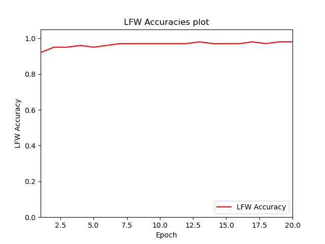
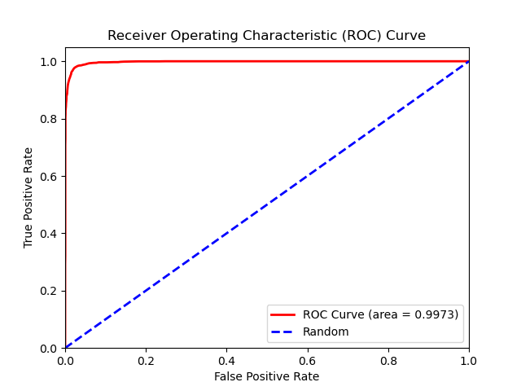

# facenet-pytorch-vggface2 (Under Development, use at your own risk)

__Operating System__: Ubuntu 18.04 (you may face issues importing the packages from the requirements.yml file if your OS differs).

A PyTorch implementation  of the [FaceNet](https://arxiv.org/abs/1503.03832) [[1](#references)] paper for training a facial recognition model using Triplet Loss. Training is done on the [VGGFace2](http://www.robots.ox.ac.uk/~vgg/data/vgg_face2/) [[2](#references)] dataset containing 3.3 million face images based on over 9000 human identities.
Evaluation is done on the Labeled Faces in the Wild [[3](#references)] dataset. Please note there are overlapping identities between the two datasets since both are based on human celebrities (500 identities), __overlapping identities were not removed from the training dataset in this implementation__.
 
A pre-trained model on tripet loss with an accuracy of __97.65%__ on the LFW dataset is provided [here](https://drive.google.com/file/d/1X83B9QMJ7AyodNTDtFXF0YiSfn1mV63j/view?usp=sharing). Please let me know if you find mistakes and errors, or improvement ideas for the code and for future training experiments. Feedback would be greatly appreciated as this is still work in progress.


### Pre-trained model
Link to download the pre-trained model using Triplet Loss [here](https://drive.google.com/file/d/1X83B9QMJ7AyodNTDtFXF0YiSfn1mV63j/view?usp=sharing).


### Pre-trained Model LFW Test Metrics
The model was trained and tested using tightly-cropped face image data using the MTCNN Face Detection model in David Sandberg's [facenet](https://github.com/davidsandberg/facenet) repository, more information is available in the [Training and Testing Datasets section](#training-and-testing-datasets).

__Note__: The available pre-trained model was not trained according to the current training method of triplet batches being constrained to a set number of human identities. The training method used for training this model could be seen by checking to older commits. __A new pre-trained model using the current training method will be uploaded hopefully soon__. I am also currently testing whether having a BatchNormalization operation on the face embeddings would yield better results than without the operation.





| Architecture | Loss | Triplet loss selection method | Embedding dimension | Margin | Training Epochs | Number of triplets per epoch| Batch Size | Optimizer | Learning Rate | LFW Accuracy| LFW Precision| LFW Recall | ROC Area Under Curve | TAR (True Acceptance Rate) @ FAR (False Acceptance Rate) = 1e-1 | TAR (True Acceptance Rate) @ FAR (False Acceptance Rate) = 1e-2 | TAR (True Acceptance Rate) @ FAR (False Acceptance Rate) = 1e-3 | Best mean Euclidean Distance |
| --- | --- | --- | --- | --- | --- | --- | --- | --- | --- | --- | --- | --- | --- | --- | --- | --- | --- |
| ResNet-18 | Triplet Loss | Semi-Hard Negatives | 256 | 0.2 | 19 | 10,000,000 | 256 | __Adagrad__ (with weight_decay=2e-4, initial_accumulator_value=0.1, eps=1e-10) | 0.05 | 0.9765+-0.0047 | 0.9755+-0.0069 | 0.9777+-0.0083 | 0.9973 | 0.9963+-0.0048 | 0.9353+-0.0201 | 0.8110+-0.0288 | 0.95+-0.0 |


### How to import and use the model
__Note__: The facial recognition model should be used with a face detection model (preferably the [MTCNN Face Detection Model]((#training-and-testing-datasets)) from David Sandberg's [facenet](https://github.com/davidsandberg/facenet) repository that was used to crop the training and test datasets for this model), the face detection model would predict the bounding box coordinates of human face in an input image then the face would be cropped and resized to size 224x224 and then inputted to the facial recognition model. Using images with no tightly-cropped face images by a face detection model as input to the facial recognition model would yield bad results. For a working example please check my other [repository](https://github.com/tamerthamoqa/facenet-realtime-face-recognition). I intend to do a pytorch version of that repository once I manage to train a facial recognition model with satisfactory LFW results.


1. Download the model (.pt) file from the [link](https://drive.google.com/file/d/1X83B9QMJ7AyodNTDtFXF0YiSfn1mV63j/view?usp=sharing) above into your project.
2. Import the 'resnet.py' and 'utils_resnet.py' modules from the 'models' folder.
3. Create a new folder in your project ('model' in this example).
4. Move the 'resnet.py', 'utils_resnet.py', and the 'model_resnet18_triplet.pt' files into the newly created 'model' folder.
5. Instantiate the model like the following example: 

```
import torch
import torchvision.transforms as transforms
import cv2
from model.resnet import Resnet18Triplet

flag_gpu_available = torch.cuda.is_available()
if flag_gpu_available:
    device = torch.device("cuda")
else:
    device = torch.device("cpu")

checkpoint = torch.load('model/model_resnet18_triplet.pt', map_location=device)
model = Resnet18Triplet(embedding_dimension=checkpoint['embedding_dimension'])
model.load_state_dict(checkpoint['model_state_dict'])
best_distance_threshold = checkpoint['best_distance_threshold']

model.to(device)
model.eval()

preprocess = transforms.Compose([
  transforms.ToPILImage(),
  transforms.Resize(size=224),  # Pre-trained model uses 224x224 input images
  transforms.ToTensor(),
  transforms.Normalize(
      mean=[0.6068, 0.4517, 0.3800],  # Normalization settings for the model, the calculated mean and std values
      std=[0.2492, 0.2173, 0.2082]     # for the RGB channels of the tightly-cropped VGGFace2 face dataset
  )
])

img = cv2.imread('face.jpg')  # Or from a cv2 video capture stream

# Note that you need to use a face detection model here to crop the face from the image and then
#  create a new face image object that will be inputted to the facial recognition model later.

# Convert the image from BGR color (which OpenCV uses) to RGB color
img = img[:, :, ::-1]

img = preprocess(img)
img = img.unsqueeze(0)
img = img.to(device)

embedding = model(img)

# Turn embedding Torch Tensor to Numpy array
embedding = embedding.cpu().detach().numpy()

```


### Training and Testing Datasets
* Download the cropped face datasets using the MTCNN Face Detection model that are used for training and testing the model:
    * VGGFace2 training dataset (224x224): [MEGA](https://mega.nz/file/CTpi3QRL#RWOyXBm5A-RuUt1TJKQLwM6QH7hd2fY4jk_EOcmcbEQ)
    * Labeled Faces in the wild testing dataset (224x224): [MEGA](https://mega.nz/file/WXpSHSqL#AlzkN_QthF9hwC2L0W9aZYv0dpg5ACKgHPON017knco)

* For cropping the face datasets using the MTCNN Face Detection model (same results as the downloadable datasets above):
    1. Download the VGGFace2 [dataset](http://www.robots.ox.ac.uk/~vgg/data/vgg_face2/) [AcademicTorrents](https://academictorrents.com/details/535113b8395832f09121bc53ac85d7bc8ef6fa5b).
    2. Download the Labeled Faces in the Wild [dataset](http://vis-www.cs.umass.edu/lfw/#download).  
    3. For face cropping for both VGGFace2 and LFW datasets; I used David Sandberg's face cropping script via MTCNN (Multi-task Cascaded Convolutional Neural Networks) from his 'facenet' [repository](https://github.com/davidsandberg/facenet):
    Steps to follow [here](https://github.com/davidsandberg/facenet/wiki/Classifier-training-of-inception-resnet-v1#face-alignment) and [here](https://github.com/davidsandberg/facenet/wiki/Validate-on-LFW#4-align-the-lfw-dataset).
    I used __--image_size 224 --margin 0__ for the VGGFace2 and LFW datasets. Running 6 python processes on the VGGFace2 dataset took around 13 hours on an i9-9900KF Intel CPU overclocked to 5 GHz. I then put both train and test folders into one folder and removed the extra files resulting from the script (bounding box text files).


### Model Training
__Notes__: 
* Training triplets will be generated at the beginning of each epoch and will be saved in the 'datasets/generated_triplets' directory as numpy files that can be loaded at the beginning of an epoch to start training without having to do the triplet generation step from scratch if required (see the __--training_triplets_path argument__).
* Each triplet batch will be constrained to a number of human identities (see the __--num_human_identities_per_batch__ argument).

1. Generate a csv file containing the image paths of the dataset by navigating to the datasets folder and running generate_csv_files.py:

    __Note__: This step is not needed if the __VGGFace2 dataset__ was face cropped using the MTCNN method described above with the default MTCNN settings, the csv file 'vggface2_full.csv' is already available in the 'datasets' directory. Be aware that the MTCNN face cropping process would eliminate some images from the full dataset.
    ```
    usage: generate_csv_files.py [-h] --dataroot DATAROOT [--csv_name CSV_NAME]
    
    Generating csv file for triplet loss!
    
    optional arguments:
      -h, --help            show this help message and exit
      --dataroot DATAROOT, -d DATAROOT
                            (REQUIRED) Absolute path to the dataset folder to
                            generate a csv file containing the paths of the images
                            for triplet loss.
      --csv_name CSV_NAME   Required name of the csv file to be generated.
                            (default: 'vggface2.csv')
    ```

2. Type in ```python train_triplet_loss.py -h``` to see the list of training options.
__Note__: '--dataroot' and '--lfw' arguments are required.

3. To train run ```python train_triplet_loss.py --dataroot "absolute path to dataset folder" --lfw "absolute path to LFW dataset folder"```

4. To resume training from a model checkpoint run ```python train_triplet_loss.py --resume "path to model checkpoint: (model.pt file)" --dataroot "absolute path to dataset folder" --lfw "absolute path to LFW dataset folder"```

5. (Optional) To __resume training from a model checkpoint__ but with __skipping the triplet generation process for the first epoch__ if the triplets file was already generated; run:
```python train_triplet_loss.py --training_triplets_path "datasets/generated_triplets/[name_of_file_here].npy" --resume "path to model checkpoint: (model.pt file)" --dataroot "absolute path to dataset folder" --lfw "absolute path to LFW dataset folder"```

```
usage: train_triplet_loss.py [-h] --dataroot DATAROOT --lfw LFW
                             [--dataset_csv DATASET_CSV] [--epochs EPOCHS]
                             [--iterations_per_epoch ITERATIONS_PER_EPOCH]
                             [--model_architecture {resnet18,resnet34,resnet50,resnet101,resnet152,inceptionresnetv2,mobilenetv2}]
                             [--pretrained PRETRAINED]
                             [--embedding_dimension EMBEDDING_DIMENSION]
                             [--num_human_identities_per_batch NUM_HUMAN_IDENTITIES_PER_BATCH]
                             [--batch_size BATCH_SIZE]
                             [--lfw_batch_size LFW_BATCH_SIZE]
                             [--num_generate_triplets_processes NUM_GENERATE_TRIPLETS_PROCESSES]
                             [--resume_path RESUME_PATH]
                             [--num_workers NUM_WORKERS]
                             [--optimizer {sgd,adagrad,rmsprop,adam}]
                             [--learning_rate LEARNING_RATE] [--margin MARGIN]
                             [--image_size IMAGE_SIZE]
                             [--use_semihard_negatives USE_SEMIHARD_NEGATIVES]
                             [--training_triplets_path TRAINING_TRIPLETS_PATH]

Training a FaceNet facial recognition model using Triplet Loss.

optional arguments:
  -h, --help            show this help message and exit
  --dataroot DATAROOT, -d DATAROOT
                        (REQUIRED) Absolute path to the dataset folder
  --lfw LFW             (REQUIRED) Absolute path to the labeled faces in the
                        wild dataset folder
  --dataset_csv DATASET_CSV
                        Path to the csv file containing the image paths of the
                        training dataset.
  --epochs EPOCHS       Required training epochs (default: 150)
  --iterations_per_epoch ITERATIONS_PER_EPOCH
                        Number of training iterations per epoch (default:
                        10000)
  --model_architecture {resnet18,resnet34,resnet50,resnet101,resnet152,inceptionresnetv2,mobilenetv2}
                        The required model architecture for training:
                        ('resnet18','resnet34', 'resnet50', 'resnet101',
                        'resnet152', 'inceptionresnetv2', 'mobilenetv2'),
                        (default: 'resnet18')
  --pretrained PRETRAINED
                        Download a model pretrained on the ImageNet dataset
                        (Default: False)
  --embedding_dimension EMBEDDING_DIMENSION
                        Dimension of the embedding vector (default: 512)
  --num_human_identities_per_batch NUM_HUMAN_IDENTITIES_PER_BATCH
                        Number of set human identities per generated triplets
                        batch. (Default: 32).
  --batch_size BATCH_SIZE
                        Batch size (default: 320)
  --lfw_batch_size LFW_BATCH_SIZE
                        Batch size for LFW dataset (default: 320)
  --resume_path RESUME_PATH
                        path to latest model checkpoint:
                        (model_training_checkpoints/model_resnet18_epoch_1.pt
                        file) (default: None)
  --num_workers NUM_WORKERS
                        Number of workers for data loaders (default: 2)
  --optimizer {sgd,adagrad,rmsprop,adam}
                        Required optimizer for training the model:
                        ('sgd','adagrad','rmsprop','adam'), (default:
                        'adagrad')
  --learning_rate LEARNING_RATE
                        Learning rate for the optimizer (default: 0.1)
  --margin MARGIN       margin for triplet loss (default: 0.2)
  --image_size IMAGE_SIZE
                        Input image size (default: 224 (224x224), must be
                        299x299 for Inception-ResNet-V2)
  --use_semihard_negatives USE_SEMIHARD_NEGATIVES
                        If True: use semihard negative triplet selection.
                        Else: use hard negative triplet selection (Default:
                        True)
  --training_triplets_path TRAINING_TRIPLETS_PATH
                        Path to training triplets numpy file in
                        'datasets/generated_triplets' folder to skip training
                        triplet generation step for the first epoch.
```


### Model state dictionary
```
state = {
    'epoch': epoch,
    'embedding_dimension': embedding_dimension,
    'batch_size_training': batch_size,
    'model_state_dict': model.state_dict(),
    'model_architecture': model_architecture,
    'optimizer_model_state_dict': optimizer_model.state_dict(),
    'best_distance_threshold': best_distance_threshold
}
```

### Inspirations (repositories)
* https://github.com/davidsandberg/facenet
* https://github.com/liorshk/facenet_pytorch
* https://github.com/tbmoon/facenet


### References
* [1] Florian Schroff, Dmitry Kalenichenko, James Philbin, “FaceNet: A Unified Embedding for Face Recognition and Clustering”:
 [paper](https://arxiv.org/abs/1503.03832)

* [2] Q. Cao, L. Shen, W. Xie, O. M. Parkhi, A. Zisserman
"VGGFace2: A dataset for recognising faces across pose and age":
[paper](https://arxiv.org/abs/1710.08092), [dataset](http://www.robots.ox.ac.uk/~vgg/data/vgg_face2/)

* [3] Gary B. Huang, Manu Ramesh, Tamara Berg, and Erik Learned-Miller.
"Labeled Faces in the Wild: A Database for Studying Face Recognition in Unconstrained Environments": [paper](http://vis-www.cs.umass.edu/lfw/lfw.pdf)


### Hardware Specifications
* TITAN RTX Graphics Card (24 gigabytes Video RAM).
* i9-9900KF Intel CPU overclocked to 5 GHz.
* 32 Gigabytes DDR4 RAM at 3200 MHz.
